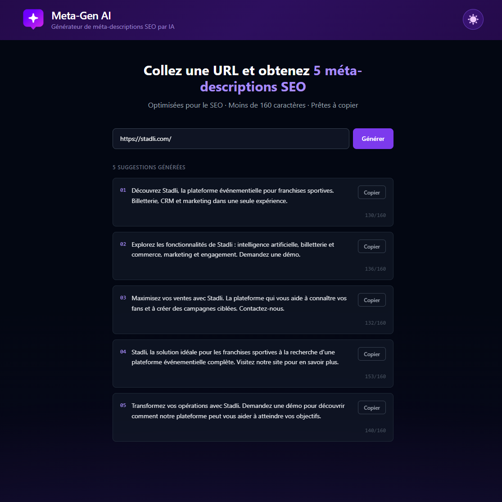

# Meta-Gen — Générateur de méta-descriptions SEO par IA

Colle l'URL d'une page web et obtiens instantanément **5 méta-descriptions SEO** optimisées, rédigées par une IA, prêtes à copier.

## Démo

**[https://gourguesnicolas.github.io/meta-gen/](https://gourguesnicolas.github.io/meta-gen/)**

## Comment ça fonctionne

1. Entre l'URL d'une page
2. Le Worker Cloudflare récupère et analyse le contenu de la page
3. L'IA génère 5 suggestions de méta-descriptions, chacune sous 160 caractères
4. Tu copies celle qui te convient en un clic

## Stack

- **Frontend** — React · TypeScript · Tailwind CSS · Vite · GitHub Pages
- **Backend** — Cloudflare Workers · Cloudflare AI (Llama 3.3 70B)

## Fonctionnalités

- Analyse le titre, la méta existante et le contenu de la page
- Génère 5 angles différents (présentation, services, bénéfices, contexte, appel à l'action)
- Compteur de caractères sur chaque suggestion
- Bouton copier sur chaque carte
- Fallback intelligent si la page bloque le scraping
